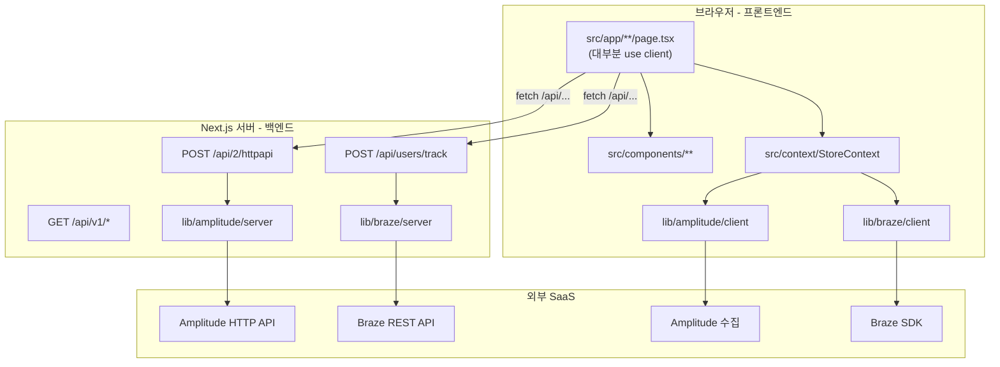

# TechStore Next.js — 프로젝트 상세 문서

이 문서는 저장소 구조, 프론트엔드/백엔드 구분, 환경 변수, Analytics 연동, 사용 기술 스택을 설명합니다.

**관련 문서**

| 문서 | 용도 |
|------|------|
| [README.md](../README.md) | 처음 보는 사람용 요약, 설치·실행·Git 치트시트 |
| [docs/PROJECT.md](./PROJECT.md) | 아키텍처·구조·환경 변수 (현재 문서) |
| [.env.example](../.env.example) | 환경 변수 키 목록 (값은 직접 입력) |

---

## 문서를 어디에 둘까? (README vs `docs/`)

| 위치 | GitHub에서 보는 방법 | 적합한 내용 |
|------|---------------------|-------------|
| **README.md** | 저장소 첫 화면에 자동 표시 | 한눈에 보는 소개, 5분 안에 실행하는 방법, 링크 |
| **`docs/` 폴더** | README 링크 또는 `docs/PROJECT.md` URL 직접 접속 | 긴 구조 설명, 아키텍처, 환경 변수 상세 |
| **Wiki** | GitHub Wiki 탭 (별도 활성화 필요) | 팀 협업·자주 바뀌는 운영 메모 |
| **`.env.example`** | 파일 뷰어 | 비밀 없이 “어떤 키가 필요한지”만 공유 |

**권장:** README는 짧게 유지하고, 지금처럼 상세 내용은 `docs/PROJECT.md`에 둡니다. GitHub는 `docs/` 안의 Markdown도 그대로 렌더링하며, README에서 링크만 걸어두면 됩니다.

---

## 프로젝트 개요

- **목적:** Next.js App Router 기반 테크 쇼핑몰 UI + **Amplitude** / **Braze** 이벤트 연동 데모
- **데이터:** 실제 DB/API 없음. 상품은 `src/data/products.ts` 정적 데이터, 로그인은 클라이언트 시뮬레이션
- **상태:** 장바구니·위시리스트·로그인 상태는 React Context + `useReducer` (브라우저 메모리, 새로고침 시 초기화)

---

## 기술 스택

### Next.js 16 (App Router)

- **역할:** React 프레임워크 + 라우팅 + 서버/클라이언트 경계
- **App Router:** `src/app/` 아래 폴더 구조가 URL이 됨 (`page.tsx` = 페이지, `layout.tsx` = 공통 레이아웃)
- **Server / Client Components:** 기본은 서버 컴포넌트. `'use client'`가 있는 파일만 브라우저에서 실행
- **API Routes:** `src/app/api/**/route.ts` — Node 런타임에서 동작하는 백엔드 엔드포인트 (별도 Express 서버 없음)
- **빌드:** `npm run build` → `.next/` 에 최적화된 산출물 생성 → `npm run start`로 서빙

### React 19

- UI 컴포넌트, Context API로 전역 스토어(`StoreContext`) 관리

### TypeScript

- 타입 정의: `src/types/index.ts`
- 경로 별칭: `@/` → `src/` (`tsconfig.json`)

### Tailwind CSS 4

- 스타일: `src/app/globals.css`, 유틸리티 클래스로 레이아웃·컴포넌트 스타일링

### Jest + Testing Library

- **Jest:** JavaScript 테스트 러너 (`npm run test`)
- **@testing-library/react:** 컴포넌트를 사용자 관점에서 렌더·클릭·검증
- **jest-environment-jsdom:** 브라우저 DOM 환경 시뮬레이션
- **next/jest:** Next.js 설정·경로 별칭을 테스트에서도 동일하게 로드 (`jest.config.js`)
- **커버리지 목표:** 전역 70% (`jest.config.js`의 `coverageThreshold`)

### Amplitude

| 구분 | 패키지 | 코드 위치 |
|------|--------|-----------|
| 브라우저 SDK | `@amplitude/analytics-browser` | `src/lib/amplitude/client.ts` |
| 서버 HTTP API | `@amplitude/analytics-node` (직접 fetch도 사용) | `src/lib/amplitude/server.ts` |

### Braze

| 구분 | 패키지 | 코드 위치 |
|------|--------|-----------|
| Web SDK | `@braze/web-sdk` | `src/lib/braze/client.ts` |
| REST API | `fetch` | `src/lib/braze/server.ts` |

---

## 프론트엔드 vs 백엔드 (이 프로젝트 기준)

Next.js는 **하나의 저장소** 안에 UI와 API가 같이 있습니다. “백엔드”는 별도 Java/Go 서버가 아니라 **Next.js 서버 쪽 코드**를 의미합니다.



### 프론트엔드 영역

| 경로 | 설명 |
|------|------|
| `src/app/**/page.tsx` | 페이지 UI (대부분 `'use client'`) |
| `src/components/**` | GNB, ProductCard, Toast, Provider 등 |
| `src/context/StoreContext.tsx` | 장바구니·위시리스트·로그인·토스트 상태 |
| `src/hooks/` | Amplitude/Braze 래퍼 훅 |
| `src/lib/*/client.ts` | 브라우저 SDK 초기화·이벤트 전송 |
| `src/lib/*/analytics.ts` | 스토어 액션 → SDK 이벤트 매핑 |
| `src/data/products.ts` | 정적 상품 목록 |
| `public/` | 정적 에셋 (이미지·아이콘 SVG) |

**환경 변수:** `NEXT_PUBLIC_` 접두사가 붙은 값만 브라우저 번들에 포함됩니다.

### 백엔드 영역 (Next.js API + 서버 라이브러리)

| 경로 | 설명 |
|------|------|
| `src/app/api/2/httpapi/route.ts` | Amplitude HTTP V2 (`/2/httpapi`) 프록시 |
| `src/app/api/users/track/route.ts` | Braze Users Track (`/users/track`) 프록시 |
| `src/app/api/v1/**` | TechStore 공개 REST API (Webhook·외부 연동) |
| `src/lib/amplitude/server.ts` | Amplitude HTTP API (`/2/httpapi`) 호출 |
| `src/lib/braze/server.ts` | Braze `/users/track` 호출 |

**환경 변수:** `AMPLITUDE_API_KEY`, `BRAZE_REST_API_KEY` 등 **접두사 없는** 변수는 서버에서만 읽습니다. 클라이언트에 노출되지 않습니다.

### 경계가 애매한 파일

| 파일 | 비고 |
|------|------|
| `src/app/layout.tsx` | 서버 컴포넌트이지만, 자식 Provider들이 클라이언트 |
| `src/lib/*/config.ts` | 서버·클라이언트 양쪽에서 import 가능. `NEXT_PUBLIC_*`는 클라이언트에도 노출됨 |

---

## 디렉터리 구조 (전체)

```
techstore-nextjs/
├── docs/
│   └── PROJECT.md          # 상세 문서 (현재 파일)
├── public/                 # 정적 파일 (favicon, svg 등)
├── src/
│   ├── app/                # Next.js App Router
│   │   ├── api/            # 백엔드 API Routes
│   │   │   ├── 2/httpapi/route.ts
│   │   │   ├── users/track/route.ts
│   │   │   └── v1/               # health, products, webhooks/braze
│   │   ├── layout.tsx      # 루트 레이아웃 (GNB, Footer, Providers)
│   │   ├── page.tsx        # 홈 (/)
│   │   ├── globals.css
│   │   ├── products/       # 전체 상품
│   │   ├── product/[id]/   # 상품 상세
│   │   ├── category/[category]/
│   │   ├── cart/
│   │   ├── wishlist/
│   │   ├── search/
│   │   ├── login/
│   │   └── mypage/
│   ├── components/         # 재사용 UI + Provider
│   │   └── __tests__/      # 컴포넌트 테스트
│   ├── context/            # 전역 상태
│   │   └── __tests__/
│   ├── data/               # 정적 상품 데이터
│   ├── hooks/              # useAmplitude, useBraze
│   ├── lib/
│   │   ├── amplitude/      # config, client, server, events, analytics
│   │   └── braze/
│   └── types/              # Product, CartItem 등
├── .env.example            # 환경 변수 템플릿 (Git에 포함)
├── .gitignore
├── jest.config.js
├── jest.setup.js
├── next.config.ts
├── package.json
└── README.md
```

---

## 페이지·API 라우트

| URL | 파일 | 설명 |
|-----|------|------|
| `/` | `app/page.tsx` | 홈, 추천 상품 |
| `/products` | `app/products/page.tsx` | 상품 목록 |
| `/product/[id]` | `app/product/[id]/page.tsx` | 상품 상세 |
| `/category/[category]` | `app/category/[category]/page.tsx` | 카테고리별 목록 |
| `/cart` | `app/cart/page.tsx` | 장바구니 |
| `/wishlist` | `app/wishlist/page.tsx` | 위시리스트 |
| `/search` | `app/search/page.tsx` | 검색 |
| `/login` | `app/login/page.tsx` | 로그인 (데모) + 서버 API 동기화 |
| `/mypage` | `app/mypage/page.tsx` | 마이페이지 |
| `POST /api/2/httpapi` | `app/api/2/httpapi/route.ts` | Amplitude HTTP V2 (공식 경로와 동일) |
| `POST /api/users/track` | `app/api/users/track/route.ts` | Braze Users Track (공식 경로와 동일) |
| `GET /api/v1/health` | `app/api/v1/health/route.ts` | 헬스체크 (Webhook 연결 테스트) |
| `GET /api/v1/products` | `app/api/v1/products/route.ts` | 상품 목록 |
| `GET /api/v1/products/:productId` | `app/api/v1/products/[productId]/route.ts` | 상품 단건 |
| `GET /api/v1/categories` | `app/api/v1/categories/route.ts` | 카테고리 목록 |
| `POST /api/v1/webhooks/braze` | `app/api/v1/webhooks/braze/route.ts` | Braze Webhook Campaign 수신 |

---

## 내부·관리자 API (Public API 아님)

| 경로 | 용도 |
|------|------|
| `POST /api/users/track` | 쇼핑몰 → Braze 연동 (서버 env 키) |
| `POST /api/2/httpapi` | 쇼핑몰 → Amplitude 연동 (서버 env 키) |
| `POST /api/admin/proxy` | 관리자 API 테스트 UI용 릴레이 (Postman 대체) |

`/api/admin/proxy` 상세 (CORS, 프록시가 필요한 이유) → **[ADMIN-PROXY.md](./ADMIN-PROXY.md)**  
관리자 UI: `/admin/proxy-guide` · API 문서: `/admin/api-docs`

---

## TechStore Public API (`/api/v1`)

Braze Webhook Campaign 등 **외부에서 TechStore 데이터를 조회**하거나 **웹훅을 수신**할 때 사용합니다.

- 인증: `.env`에 `TECHSTORE_API_KEY` 설정 시 `Authorization: Bearer <key>` 또는 `X-Api-Key` 필요
- Braze Webhook: `BRAZE_WEBHOOK_SECRET` 설정 시 `X-Braze-Webhook-Secret` 헤더 필요

예시 (로컬):

```bash
curl http://localhost:3000/api/v1/health
curl "http://localhost:3000/api/v1/products?category=laptop&limit=5" -H "Authorization: Bearer YOUR_KEY"
curl http://localhost:3000/api/v1/products/1 -H "X-Api-Key: YOUR_KEY"
curl -X POST http://localhost:3000/api/v1/webhooks/braze -H "Content-Type: application/json" -d '{"external_id":"user_1"}'
```

---

## Analytics 데이터 흐름

### 1) 일반 쇼핑 액션 (장바구니, 위시리스트 등)

1. 사용자가 UI에서 액션 (예: 장바구니 담기)
2. `StoreContext`의 `dispatch` → `storeReducer`로 상태 변경
3. 동시에 `trackAmplitudeStoreAction` / `trackStoreAction` 호출
4. 각각 **브라우저 SDK**로 이벤트 전송 (API 키는 `NEXT_PUBLIC_*`)

### 2) 로그인 시 (클라이언트 + 서버 이중 전송)

1. `login/page.tsx`에서 `dispatch({ type: 'LOGIN', ... })`
2. Context가 SDK로 로그인 이벤트 전송
3. 추가로 `syncUserViaAmplitudeApi` / `syncUserViaBrazeApi`가 **같은 출처**의 `/api/*/track` 호출
4. API Route가 **서버 전용 키**로 Amplitude HTTP API / Braze REST 호출

이 패턴은 “브라우저 SDK + 서버에서 확실히 기록”을 동시에 검증하기 위한 데모 구성입니다.

### 이벤트 이름

| 액션 | Amplitude (`events.ts`) | Braze (`events.ts`) |
|------|-------------------------|---------------------|
| 장바구니 추가 | `Added to Cart` | `added_to_cart` |
| 장바구니 삭제 | `Removed from Cart` | `removed_from_cart` |
| 위시리스트 추가 | `Added to Wishlist` | `added_to_wishlist` |
| 로그인 | `User Login` | `user_login` |
| 로그아웃 | `User Logout` | `user_logout` |

---

## 환경 변수

### 파일 위치·우선순위

| 파일 | 사용 시점 | Git |
|------|-----------|-----|
| `.env.local` | 로컬 개발 (권장) | **커밋 안 됨** (`.gitignore`) |
| `.env` | 로컬/서버 공통 | **커밋 안 됨** |
| `.env.production` | `npm run build` / `start` 시 | **커밋 안 됨** |
| `.env.example` | 키 이름만 참고용 템플릿 | **커밋됨** (값 비움) |

Next.js 규칙:

- `NEXT_PUBLIC_` → **브라우저에 포함** (노출된다고 가정)
- 그 외 → **서버에서만** 사용

설정 읽기 코드: `src/lib/amplitude/config.ts`, `src/lib/braze/config.ts`

### Amplitude — 필요한 값

| 변수 | 필수 | 노출 | 설명 | 어디서 얻나 |
|------|------|------|------|------------|
| `NEXT_PUBLIC_AMPLITUDE_API_KEY` | 클라이언트 SDK 사용 시 | 브라우저 | Browser SDK용 API Key | Amplitude → Settings → Projects → **[Your Project]** → API Keys |
| `NEXT_PUBLIC_AMPLITUDE_ENABLE_LOGGING` | 아니오 | 브라우저 | `true`면 디버그 로그 | 직접 `true` / `false` |
| `NEXT_PUBLIC_AMPLITUDE_SERVER_ZONE` | 아니오 | 브라우저 | `US` 또는 `EU` | 프로젝트 리전에 맞게 |
| `AMPLITUDE_API_KEY` | 서버 API 사용 시 | 서버만 | HTTP API용 (미설정 시 `NEXT_PUBLIC_*` fallback) | 동일 프로젝트 API Key (서버 전용으로 분리 권장) |
| `AMPLITUDE_API_BASE_URL` | 아니오 | 서버만 | 기본 `https://api2.amplitude.com` | EU 리전이면 Amplitude 문서의 EU 엔드포인트 |

**동작:** 키가 없으면 `enabled: false` → SDK 초기화·서버 전송 스킵 (앱은 계속 동작).

### Braze — 필요한 값

| 변수 | 필수 | 노출 | 설명 | 어디서 얻나 |
|------|------|------|------|------------|
| `NEXT_PUBLIC_BRAZE_API_KEY` | Web SDK 사용 시 | 브라우저 | Web App API Key | Braze Dashboard → **Settings** → **App Settings** → Web 앱 |
| `NEXT_PUBLIC_BRAZE_SDK_ENDPOINT` | Web SDK 사용 시 | 브라우저 | **sdk.*** URL (예: `https://sdk.iad-01.braze.com`) | 동일 App Settings 화면의 SDK Endpoint |
| `NEXT_PUBLIC_BRAZE_ENABLE_LOGGING` | 아니오 | 브라우저 | `true`면 SDK 로그 | 직접 설정 |
| `BRAZE_REST_API_KEY` | 서버 REST 사용 시 | 서버만 | REST API Key | **Settings** → **API Keys** → REST API Key |
| `BRAZE_REST_API_URL` | 서버 REST 사용 시 | 서버만 | **rest.*** URL (예: `https://rest.iad-01.braze.com`) | Dashboard 상단 클러스터 / API Keys 문서 |

**주의:** `NEXT_PUBLIC_BRAZE_SDK_ENDPOINT`에 **rest.*** URL을 넣으면 Web SDK가 동작하지 않습니다. 코드에서 개발 시 콘솔 경고를 냅니다 (`config.ts`).

**동작:** Web SDK는 `apiKey` + `sdkEndpoint` 둘 다 있어야 `enabled`. REST는 `BRAZE_REST_API_KEY` + `BRAZE_REST_API_URL` 둘 다 필요.

### 로컬 설정 예시

```bash
cp .env.example .env.local
# 에디터로 실제 키 입력 후
npm run dev
```

### EC2 / 프로덕션

- 배포 서버에 `.env` 또는 `.env.production` 생성 (Git에 올리지 않음)
- `npm run build` **전에** 환경 변수가 로드되어야 `NEXT_PUBLIC_*`가 빌드에 반영됨
- PM2 사용 시 `env_file` 또는 시스템 환경 변수로 주입 가능

---

## `.gitignore`로 제외되는 영역

| 패턴 | 제외 대상 | 이유 |
|------|-----------|------|
| `/node_modules` | npm 패키지 | 용량·재설치 가능 |
| `/.next/`, `/out/`, `/build` | 빌드 산출물 | `npm run build`로 재생성 |
| `/coverage` | Jest 커버리지 리포트 | 로컬 테스트 결과 |
| `.env*` | **모든 env 파일** | API 키·비밀 유출 방지 |
| `.vercel` | Vercel 로컬 설정 | 배포 도구 개인 설정 |
| `*.tsbuildinfo`, `next-env.d.ts` | TS 빌드 캐시·자동 생성 타입 | 재생성 가능 |
| `.DS_Store`, `*.pem` | OS·인증서 잡파일 | 불필요 |

**예외:** `.env.example`은 `.env*` 패턴에 걸리므로, Git에 포함하려면 `.gitignore`에 `!.env.example` 한 줄을 추가해야 합니다. 현재 저장소에 `.env.example`을 추가할 경우 해당 예외 규칙을 넣는 것을 권장합니다.

---

## 테스트 구조

```
src/
  components/__tests__/     GNB.test.tsx, ProductCard.test.tsx
  context/__tests__/        StoreContext.test.tsx
  app/category/[category]/__tests__/  page.test.tsx
```

| 명령 | 용도 |
|------|------|
| `npm run test` | CI·배포 전 1회 전체 실행 |
| `npm run test:watch` | 개발 중 파일 변경 시 재실행 |
| `npm run test:coverage` | 커버리지 리포트 (`coverage/` → gitignore) |

테스트는 주로 **프론트엔드 컴포넌트·Context**를 대상으로 하며, Amplitude/Braze는 mock 하거나 비활성 설정으로 동작합니다.

---

## 주요 설정 파일

| 파일 | 역할 |
|------|------|
| `next.config.ts` | Turbopack root, `images.remotePatterns` (placeholder·unsplash) |
| `package.json` | 스크립트·의존성 |
| `jest.config.js` | Jest + Next 연동, `@/` alias, 커버리지 70% |
| `jest.setup.js` | `@testing-library/jest-dom` 등 전역 설정 |
| `eslint.config.mjs` | ESLint (Next 기본 규칙) |
| `postcss.config.mjs` | Tailwind PostCSS |

---

## 확장 시 참고

- **실제 백엔드 DB:** `src/app/api/` 아래에 인증·주문 API 추가하거나, 별도 BFF 서버 연동
- **비밀 관리:** EC2에서는 AWS SSM Parameter Store, GitHub Actions Secrets 등 사용
- **이벤트만 켜기:** 최소한 `NEXT_PUBLIC_AMPLITUDE_API_KEY` + (Braze) `NEXT_PUBLIC_BRAZE_*` 두 개, 서버 검증까지는 REST/Amplitude 서버 키 추가

---

## 저장소

https://github.com/devbyjunha/techstore-nextjs
